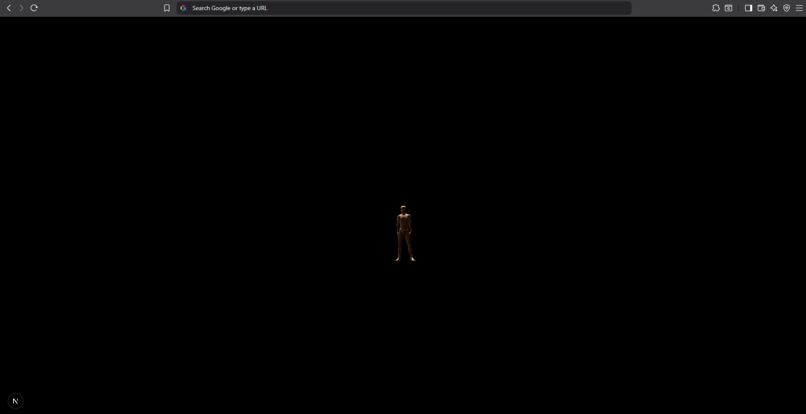

# <Deno-NextJS-WebGPU-Boilerplate>

## Description

I wanted to test WebGPU as a renderer for a 3D game engine, and NextJS as a framework for the game engine.The purpose was to get better fps on lower end computers, mostly cards missing raytracing capabilities. I learnt alot about Blender and how to do animations as well as how to setup Deno with NextJS.


## Table of Contents

If your README is long, add a table of contents to make it easy for users to find what they need.

- [Prerequisites](#prerequisites)
- [Installation](#installation)
- [Usage](#usage)
- [Credits](#credits)
- [License](#license)
- [Features](#features)
- [Tests](#tests)


## Prerequisites

- Docker Compose
- Make
- SpacetimeDB

## Installation

```bash
make setup-development
```

## Usage

```bash
make start-development
```

```bash
make stop-development
```



## Credits

https://github.com/ektogamat/r3f-webgpu-starter

## License

MIT

## Features

* High volume Rust back-end
* High performance WebGPU renderer
* High performance NextJS front-end
* High performance SpacetimeDB database
* High performance Deno server

## Tests

No test's yet